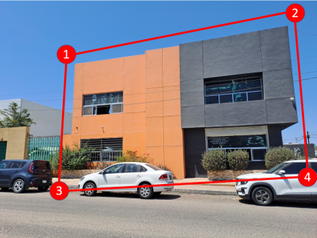

# Local Images Method 

**Best for:** Create a building stock from images stored on your local device. Ideal for characterizing buildings in locations where there is no access with GSV and whose images already exist, e.g., inside a factory.

**Workflow:**
1. **Set the usage mode**  
   Select the **Local images** option, and then click the ***Input Requirements*** button.
   
2. **Select the output project folder**  
   Click the ***Select output folder*** button to open a pop-up window and navigate to the folder where outputs will be saved.  
   > 📁 *Example:* `demos/local_images`
    
3. **Select local image folder**  
   Click the ***Select image folder*** button to open a pop-up window and navigate to the folder where the images are stored.  
   > 📁 *Example:* `demos/local_images/images_ex1`
   
4. **Set Input Files**  
   Click the ***Upload building information*** button to open a pop-up window and navigate to the file containing the building coordinates and image name and extension.  
   
   > 📁 *Example:* `demos/local_images/data_ex1.csv`  
   > 📝 *Required CSV format:*
   
   ```csv
   id,latitude,longitude
   IMG_01.jpg,10.9639,-74.7964
   IMG_02.png,10.9550,-74.7853
   ```
   At this point, the file will be previewed in a table so you can verify the selected information.
   
	- 4.1. The results will be saved using the name specified in the ***Output name*** field (default: **"Local_images"**) as a `.csv` file. This file will contain all the building features, along with metadata such as city, country, coordinates, and the path to the corresponding building image.
	- 4.2. A maximum of three windows can display the same location from different perspectives, allowing for a more accurate classification of the target building. These windows are displayed automatically when the images share the same coordinates.  
	- 4.3. Click ***Save and Continue*** to proceed to the next step.

5. **Classification options, the user can classify building features in two ways:**
     
   **I)** Manually or **II)** Using Deep Learning models with verification of predicted attributes.

	- 5.1. 📝 ***Manual Classification***
		- **5.1.1.** Click the ***Next Building*** button to upload and display the first building image.
		- **5.1.2.** Specify the construction epoch that is most relevant to the area under analysis (this step is only required for the first analysis).
		- **5.1.3.** Use the corresponding combo boxes to select the appropriate features based on the displayed image (e.g., select "Concrete" as the LLRS material).
		- **5.1.4.** Click the ***Next Building*** button again to proceed to the next image, and repeat this process until all images have been reviewed.
		- **5.1.5.** Save either all results or a partial set by clicking the ***Save Data*** button. When the GUI is launched again, previously saved results will be reloaded, allowing the classification process to resume from where it left off.  
		> ⚠️ **Important:** *If you do not save your data before closing the GUI, your work will be lost.*

	- 5.2. 🤖 ***AI-Powered Classification***
		- **5.2.1.** The ***AI Powered*** checkbox will be activated, which means the feature will be predicted using AI.  
However, the user can easily switch back to manual inspection by clicking the checkbox again.
		- **5.2.2.** Upload the images by clicking the ***Next Building*** button. At this step, the tool will automatically predict the building features.
		- **5.2.3.** The user should manually define the epoch of construction, vertical irregularity, number of bays, and image quality, since there are currently no models available for these features
		- **5.2.4.** Click the ***Next Building*** button again to proceed to the next image, and repeat this process until all images have been reviewed.
		- **5.2.5.** Save either all results or a partial set by clicking the ***Save data*** button. When the GUI is launched again, previously saved results will be reloaded, allowing the classification process to resume from where it left off.  
		> ⚠️ **Important:** *If you do not save your data before closing the GUI, your work will be lost.*

6. **Main interface features**
   
	- **6.1 Manual Box**
	     - If the automatic delimitation of the building is not adequate for proper isolation,  
		   or if the selected building is not the building of interest, the user can define a manual bounding box by clicking on four points.
			
	- **6.2 Review Previous Classifications**
	     - If you want to check a specific image, use the ***Search Building*** button. First, enter the image ID (e.g., `1`) in the adjacent field, then click the ***Search Building*** button. The GUI will automatically display the corresponding image and its saved classification.
		   > ⚠️ **Important:** *This only works for inspections that were previously saved.*
   
