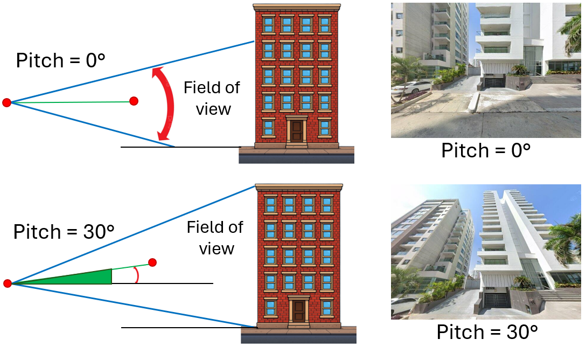

# Polygon Method 
**Best for:** Create a building stock from well defined area such as a neighborhood, city, or similar

**Workflow:**
1. **Set the usage mode**  
   Select the **Polygon method** option, and then click the ***Input Requirements*** button.
   
2. **Select the output project folder**  
   Click the ***Select output folder*** button to open a pop-up window and navigate to the folder where outputs will be saved.  
   > 📁 *Example:* `demos/polygon_method`
    
3. **Set the polygon source**  
   Select the desired option from the dropdown menu. There are two available methods:  
   **(I)** Vertex coordinates  
   **(II)** Existing polygon

4. **Upload the polygon file**  
   Click the ***Upload polygon file*** button to open a pop-up window and navigate to the input files.

   - **4.1 Vertex coordinates**  
     Select a `.csv` file containing the polygon vertex coordinates.  
     > 📁 *Example:* `demos/polygon_method/polygon_method_example.csv`  
     > 📝 *Required CSV format:*

     ```csv
     id,latitude,longitude
     1,10.9639,-74.7964
     2,10.9640,-74.7965
     ```

     The file will be previewed in a table so you can verify that the information is correct.

   - **4.2 Existing polygon**  
     Select and upload a `.gpkg` or `.shp` file.

5. **Define the Source of the Building Footprint**  
Select the desired option from the menu next to ***Footprint source***.  
By default, the selected option is **OpenStreetMap**, but **Overture Maps** is also available.  
Overture combines different sources of information, such as Google Open Buildings, Microsoft Building Footprints, and OpenStreetMap.  
However, this option may take more time to retrieve the footprints.
   
6. **Download the available building footprints in the defined area by clicking the ***Get footprints available*** button**  

   - **6.1. Footprint Sample**
     - The number of available footprints will be displayed next to the text ***N° footprints***.  
     - The user should define the sample size using the ***Sample size*** field. This value must be equal to or less than the total number of available building footprints.  

7. **Classification options, the user can classify building features in two ways:**
     
   **I)** Manually or **II)** Using Deep Learning models with verification of predicted attributes.

	- 7.1. 📝 ***Manual Classification***
		- **7.1.1.** Click the ***Next Building*** button to upload and display the first building image.
		- **7.1.2.** User should provide the construction epoch classes (this step is only required for the first analysis).
		- **7.1.3.** Use the corresponding combo boxes to select the appropriate features based on the displayed image (e.g., select "Concrete" as the LLRS material).
		- **7.1.4.** Click the ***Next Building*** button again to proceed to the next image, and repeat this process until all images have been reviewed.
		- **7.1.5.** Save either all results or a partial set by clicking the ***Save Data*** button. When the GUI is launched again, previously saved results will be reloaded, allowing the classification process to resume from where it left off.  
		> ⚠️ **Important:** *If you do not save your data before closing the GUI, your work will be lost.*

	- 7.2. 🤖 ***AI-Powered Classification***
		- **7.2.1.** The ***AI Powered*** checkbox will be activated, which means the feature will be predicted using AI.  
However, the user can easily switch back to manual inspection by clicking the checkbox again.
		- **7.2.2.** Upload the images by clicking the ***Next Building*** button. At this step, the tool will automatically predict the building features.
		- **7.2.3.** The user should manually define the epoch of construction, vertical irregularity, number of bays, and image quality, since there are currently no models available for these features.
		- **7.2.4.** Click the ***Next Building*** button again to proceed to the next image, and repeat this process until all images have been reviewed.
		- **7.2.5.** Save either all results or a partial set by clicking the ***Save Data*** button. When the GUI is launched again, previously saved results will be reloaded, allowing the classification process to resume from where it left off.  
		> ⚠️ **Important:** *If you do not save your data before closing the GUI, your work will be lost.*
	
	- 7.3. The results will be saved using the name specified in the ***Output name*** field (default: **"polygon_building"**) as a `.csv` file. This file will contain all the building features, along with metadata such as city, country, coordinates, and the path to the corresponding building image.
		> ⚠️ **Important:** *Since this is the first version, it is strongly recommended to verify the results from the AI-powered mode.*

8. **Main interface features**
   
	- **8.1 Manual Box**
	     - If the automatic delimitation of the building is not adequate for proper isolation,  
		   or if the selected building is not the building of interest, the user can define a manual bounding box by clicking on four points.

			
	- **8.2 Set Image Angle**  
		- The user can define the **pitch** angle, which controls the **vertical inclination of the camera**, allowing a full view of tall buildings. This angle is limited between **0°** and **60°**, with **5°** as the default value.  
		

		- The user can also define the **heading** angle, which refers to the **horizontal camera angle**, controlling the direction of the camera and even allowing a view of buildings on the opposite side of the street (180°). This angle is limited between **–180°** and **180°**, with **0°** as the default value.

		- The user can also define the **FOV** (field of view). The FOV controls the **camera zoom**: smaller values zoom in, while larger values zoom out. By default, this value is set to **120**, which is the maximum allowed. This helps create a natural zoom effect without losing too much resolution in distant building images.

	- **8.3 Review Previous Classifications**
	     - If you want to check a specific image, use the ***Search Building*** button. First, enter the image ID (e.g., `1_1`) in the adjacent field, then click the ***Search Building*** button. The GUI will automatically display the corresponding image and its saved classification.
		   > ⚠️ **Important:** *This only works for inspections that were previously saved.*

	- **8.4 Building Attribute Prediction**
	     - Even when up to three images are displayed, only one image is used to classify the building. The selected image is identified by a highlighted border.
        
9. **API Key Configuration**  

The user must create two Google API keys:  
- **Google Street View Static API** → saved as ***gsv_api_key.txt***  
- **Google Roads API** → saved as ***roads_api_key.txt***  

Both files should be placed inside the `methods` folder.  

> 📁📝 *Example:* `methods/gsv_api_key.txt`  
> 📁📝 *Example:* `methods/roads_api_key.txt`
