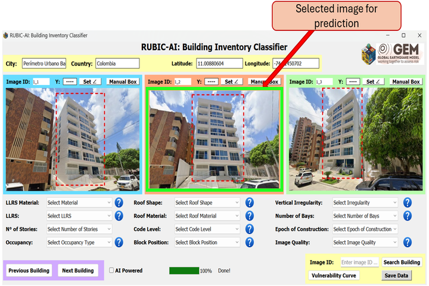

# Specific Coordinates Method 
**Best for:** Characterizing specific buildings, for example: reviewing all hospitals in the area of analysis, even if they are located in different countries.

**Workflow:**
1. **Set the usage mode**  
   Select the **Specific coordinates** option, and then click the ***Input Requirements*** button.

2. **Set the output prefix**  
   Select The results will be saved using the name specified in the ***Output name*** field (default: **"specific_coord"**) as a `.csv` file. This file will contain all the building features, along with metadata such as city, country, coordinates, and the path to the corresponding building image.

3. **Select the output project folder**  
   Click the ***Select output folder*** button to open a pop-up window and navigate to the folder where outputs will be saved.  
   > 📁 *Example:* `demos/specific_coordinates`
    
4. **Set input files**  
   Click the ***Upload file with coordinates*** button to open a pop-up window and navigate to the file where the coordinates of the building of interest are stored.
   > 📁 *Example:* `demos/specific_coordinates/specific_coordinates_example_data.csv`  
   > 📝 *Required CSV format:*
   
   ```csv
   id,latitude,longitude
   1,10.9639,-74.7964
   2,10.9640,-74.7965
   ```
	  At this point, the file will be previewed in a table so you can verify the selected information.  
	  
5. **Image Source**
Users can select one of the following image sources:
	(I). **Google Street View (GSV) imagery**
	(II). **Mapillary imagery**

Google Street View generally provides broader global coverage and more consistent imagery. However, access to the GSV API requires a paid service.
Mapillary provides street-level and 360° imagery contributed mainly by members of the public. As a result, its geographical coverage may be more limited or uneven. Nevertheless, users can upload their own 360° videos to Mapillary, creating a practical alternative for rapidly collecting street-level imagery and supporting exposure modelling and building-attribute classification.
After selecting the image source and providing the required input files, click **Save and Continue** to validate the information.
If a required field is missing or a column name is incorrect, the GUI will display a message identifying the missing or invalid fields.

6. **Classification options, the user can classify building features in two ways:**
     
   **I)** Manually or **II)** Using Deep Learning models with verification of predicted attributes.

	- 6.1. 📝 ***Manual Classification***
		- **6.1.1.** Click the ***Next Building*** button to upload and display the first building image.
		- **6.1.2.** User should provide the construction epoch classes (this step is only required for the first analysis).
		- **6.1.3.** Use the corresponding combo boxes to select the appropriate features based on the displayed image (e.g., select "Concrete" as the LLRS material).
		- **6.1.4.** Click the ***Next Building*** button again to proceed to the next image, and repeat this process until all images have been reviewed.
		- **6.1.5.** Save either all results or a partial set by clicking the ***Save Data*** button. When the GUI is launched again, previously saved results will be reloaded, allowing the classification process to resume from where it left off.  
		> ⚠️ **Important:** *If you do not save your data before closing the GUI, your work will be lost.*

	- 6.2. 🤖 ***AI-Powered Classification***
		- **6.2.1.** The ***AI Powered*** checkbox will be activated, which means the feature will be predicted using AI.  
However, the user can easily switch back to manual inspection by clicking the checkbox again.
		- **6.2.2.** Upload the images by clicking the ***Next Building*** button. At this step, the tool will automatically predict the building features.
		- **6.2.3.** The user should manually define the epoch of construction, vertical irregularity, number of bays, and image quality, since there are currently no models available for these features.
		- **6.2.4.** Click the ***Next Building*** button again to proceed to the next image, and repeat this process until all images have been reviewed.
		- **6.2.5.** Save either all results or a partial set by clicking the ***Save Data*** button. When the GUI is launched again, previously saved results will be reloaded, allowing the classification process to resume from where it left off.  
		> ⚠️ **Important:** *If you do not save your data before closing the GUI, your work will be lost.*

7. **Main interface features**
   
	- **7.1 Manual Box**
	     - If the automatic delimitation of the building is not adequate for proper isolation,  
		   or if the selected building is not the building of interest, the user can define a manual bounding box by clicking on four points.

			
	- **7.2 Set Image Angle**  
		- The user can define the **pitch** angle, which controls the **vertical inclination of the camera**, allowing a full view of tall buildings. This angle is limited between **0°** and **60°**, with **5°** as the default value.  
		

		- The user can also define the **heading** angle, which refers to the **horizontal camera angle**, controlling the direction of the camera and even allowing a view of buildings on the opposite side of the street (180°). This angle is limited between **–180°** and **180°**, with **0°** as the default value.

		- The user can also define the **FOV** (field of view). The FOV controls the **camera zoom**: smaller values zoom in, while larger values zoom out. By default, this value is set to **120**, which is the maximum allowed. This helps create a natural zoom effect without losing too much resolution in distant building images.

	- **7.3 Review Previous Classifications**
	     - If you want to check a specific image, use the ***Search Building*** button. First, enter the image ID (e.g., `1_1`) in the adjacent field, then click the ***Search Building*** button. The GUI will automatically display the corresponding image and its saved classification.
		   > ⚠️ **Important:** *This only works for inspections that were previously saved.*
	
	- **7.4 Building Attribute Prediction**
	     - Even when up to three images are displayed, only one image is used to classify the building. The selected image is identified by a highlighted border.
   		 
		 
8. **API Key Configuration**  

The user must create two Google API keys:  
- [Google Street View Static API](https://developers.google.com/maps/documentation/streetview/get-api-key) → saved as ***gsv_api_key.txt***  
- [Google Roads API](https://developers.google.com/maps/documentation/roads/get-api-key)  → saved as ***roads_api_key.txt***

For Mapillary the user must create just one API key:
- [Mapillary API](https://www.mapillary.com/developer)  → saved as ***mapillary_api_key.txt***

All API keys should be placed inside the `methods` folder.  

> 📁📝 *Example:* `methods/gsv_api_key.txt`  
> 📁📝 *Example:* `methods/roads_api_key.txt`

> 📁📝 *Example:* `methods/mapillary_api_key.txt`
